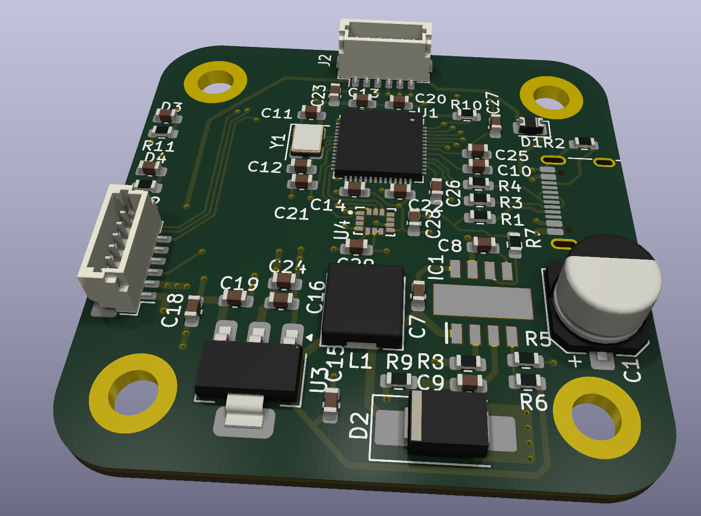
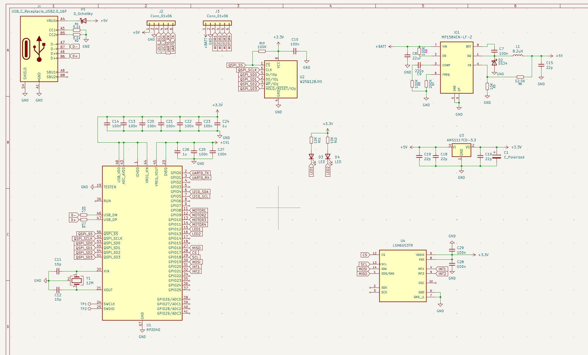
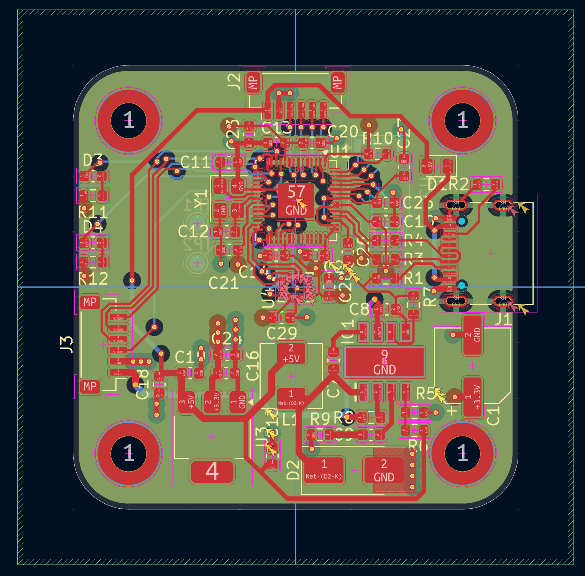

# ScrapHawk

*Ultra-budget, high-performance RP2040 flight controller stack bypassing expensive legacy silicon.*

## The Concept: Rethinking the Flight Controller

For years, custom flight controllers have relied on expensive, legacy single-core silicon. ScrapHawk takes a radically different approach. By utilizing the ultra-affordable Raspberry Pi RP2040, modern FreeRTOS Symmetric Multiprocessing (SMP), and hardware-level Programmable I/O (PIO), ScrapHawk delivers a zero-latency, high-performance flight stack on a hacker's budget.

Beyond the silicon, ScrapHawk solves one of the most frustrating problems in drone engineering: Electromagnetic Interference (EMI) from high-current motor ESCs disrupting sensitive navigation sensors. 

To combat this, the ScrapHawk architecture is physically decoupled into two separate printed circuit boards connected by a 6-pin JST-SH (1.0mm) umbilical cable.

---

## Software Architecture: Multi-Core RTOS & PIO Offloading

The RP2040 features dual Cortex-M0+ cores. Instead of treating this as a generic processing pool, ScrapHawk leverages FreeRTOS SMP to rigidly enforce core affinity, completely decoupling the real-time flight dynamics from slower, blocking navigation tasks.

### PIO: Zero-Latency Motor Control
Traditionally, generating DSHOT signals for ESCs requires complex timer/DMA configurations that eat up CPU cycles. ScrapHawk completely bypasses the CPU for motor control. By mapping the motor output pins to the RP2040's hardware PIO state machines, the DSHOT timing is handled independently at the hardware level. Core 0 simply pushes throttle values into a FIFO buffer, and the PIO hardware seamlessly clocks out the precise DSHOT pulses.

---

## Hardware Architecture: Split-Board Design

### Board 1: Main FC (The Brain & Muscle)

This is the core flight management and power delivery board, situated in the center of the drone frame.
* **MCU:** Raspberry Pi RP2040 (QFN-56) paired with 16MB QSPI Flash (Winbond W25Q128JVSIQ).
* **IMU:** STMicroelectronics LSM6DS3TR-C, placed precisely at the physical center of the PCB for accurate rotational data. Routed via SPI0 with Data Ready Interrupts.
* **Power Delivery:** A robust dual-stage filter ensures clean power despite ESC noise. A massive 470uF 35V Low-ESR input capacitor feeds a 5V Buck Converter (MP1584EN, 10uH inductor), which then feeds a 3.3V LDO (AMS1117-3.3).
* **Motor & Receiver I/O:** 4 corner ESC solder pads driven by PIO (GPIO 10-13), plus a dedicated 4-pin header for ExpressLRS 2.4GHz receivers via UART1.
* **Connectivity:** USB-C with proper dual 5.1kΩ pull-downs and 27Ω D+/D- series resistors. 
* **The Umbilical:** A 6-pin right-angle SMD connector carrying 5V, GND, UART0 (for GPS), and I2C0 (for Compass). It crucially includes 2.2kΩ pull-up resistors on the I2C lines to maintain signal integrity over the physical wire capacitance.

### Board 2: Nav Puck (The Senses)

Designed to be mounted high on a mast, this board keeps the magnetometer and GPS completely isolated from the EMI generated by the motors and power leads.
* **Clean Local Power:** Receives 5V from the umbilical, which is filtered again through a localized AMS1117-3.3 LDO to provide exceptionally clean power exclusively for the sensors.
* **GPS:** Zhongke Micro ATGM336H-5N (UART) equipped with a U.FL connector for an active ceramic patch antenna. It includes an onboard MS621FE 3V backup battery to retain ephemeris data for instant hot-starts.
* **Compass:** QST QMC5883L (I2C) for precise, noise-free heading data.

---

## Who is this for?
ScrapHawk is designed for drone hardware hackers, custom flight controller developers, and FreeRTOS engineers who want to explore modern RTOS paradigms and PIO capabilities without being locked into expensive, proprietary, or legacy ecosystems. It proves that with clever software engineering and thoughtful hardware isolation, cheap silicon can fly just as well—if not better—than the expensive alternatives.